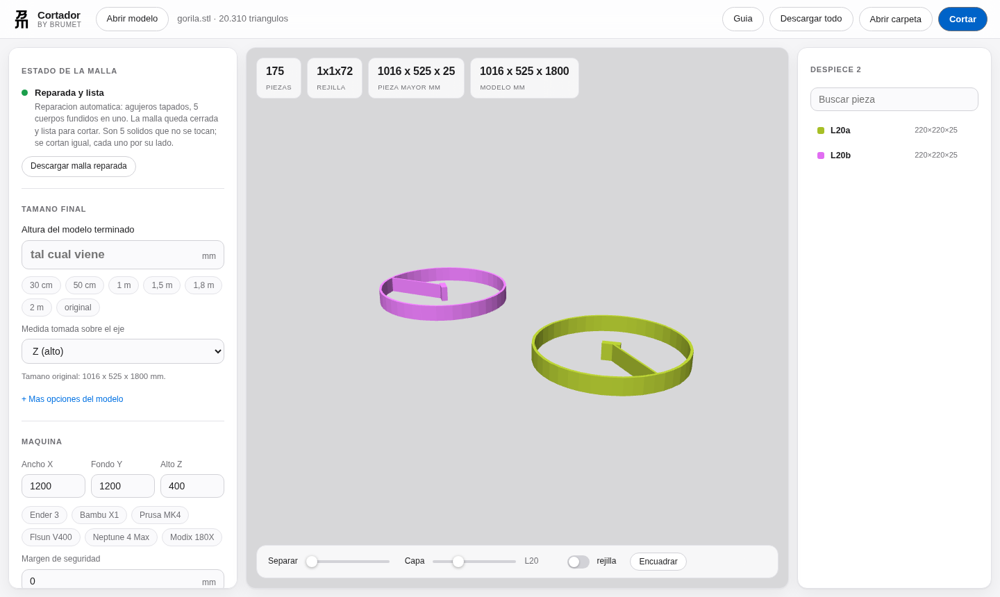

<p align="center">
  
</p>

<h1 align="center">Cortador</h1>
<p align="center"><b>by Brumet</b> · corta modelos 3D para gran formato</p>

<p align="center">
  <a href="https://github.com/Brumet/Cortador/releases/latest/download/Cortador-Windows.exe"><b>⬇ Descargar para Windows</b></a> ·
  <a href="https://github.com/Brumet/Cortador/releases/latest/download/Cortador-Linux"><b>Linux</b></a> ·
  <a href="#instalacion">Instalacion</a> ·
  <a href="#uso-la-interfaz">Uso</a> ·
  <a href="#linea-de-comandos">Terminal</a>
</p>

---

Metes una malla (STL, OBJ, PLY, 3MF...), dices **cuanto quieres que mida el modelo
terminado** y **cuanto mide tu impresora**, y Cortador la parte en piezas que si
caben, o en **laminas del espesor que quieras** (3 mm, 5 mm, 18 mm...).

Y lo importante para gran formato: puede **vaciar el modelo** y quedarse solo con
la **piel** del grosor que le digas, como el *Solidify* de Blender. Una figura de
1,80 m deja de ser un bloque macizo de 230 litros y pasa a ser una cascara de
11 litros: **95 % menos de material y de horas de maquina**.

Cada pieza sale **marcada con su nombre grabado** y, si quieres, con **pasadores
de alineacion**, para que luego puedas armar el modelo entero sin volverte loco.

Es una **aplicacion de escritorio**: se abre en su propia ventana, no en el
navegador. Todo ocurre **en tu equipo**, funciona sin conexion y ningun modelo se
sube a ningun servidor. Codigo libre con licencia MIT.


---

## Instalacion

### Opcion 1 — la app, sin instalar nada (recomendada)

1. Descarga **[Cortador-Windows.exe](https://github.com/Brumet/Cortador/releases/latest/download/Cortador-Windows.exe)**
   (o **[Cortador-Linux](https://github.com/Brumet/Cortador/releases/latest/download/Cortador-Linux)**).
   Todas las versiones estan en **[Releases](https://github.com/Brumet/Cortador/releases/latest)**.
2. Doble clic. Se abre en su propia ventana.

No necesita Python, ni internet, ni permisos de administrador. Puedes llevarlo en
un USB y usarlo en cualquier PC las veces que quieras.

> Windows mostrara un aviso de SmartScreen la primera vez porque el archivo no
> esta firmado: *Mas informacion → Ejecutar de todas formas*.

### Opcion 2 — desde el codigo (Windows)

1. Descarga el codigo: en **[Releases](https://github.com/Brumet/Cortador/releases/latest)**
   baja *Source code (zip)*, o pulsa **Code → Download ZIP** en la portada del repo. Descomprimelo.
2. Doble clic en **`Cortador.bat`**. La primera vez se instala sola (necesita
   [Python](https://www.python.org/downloads/) con *Add Python to PATH* marcado);
   despues ya arranca directo.

### Opcion 3 — desde el codigo (Linux / macOS)

```bash
git clone https://github.com/Brumet/Cortador.git
cd Cortador
./cortador.sh          # instala la primera vez y abre la aplicacion
```

En Linux, la ventana de escritorio necesita WebKitGTK
(`sudo apt install python3-gi gir1.2-webkit2-4.1`) o Qt
(`pip install pyqt5 pyqtwebengine`). Si no encuentra ninguno, Cortador avisa y
abre la interfaz en el navegador para que puedas trabajar igual.

O a mano, si prefieres controlar el entorno:

```bash
python -m venv .venv && source .venv/bin/activate
pip install -e ".[web,app]"
cortador app          # ventana de escritorio
cortador web          # o en el navegador, si lo prefieres
```

### Compilar tu propio ejecutable

```bash
pip install pyinstaller
python packaging/construir.py     # deja dist/Cortador(.exe)
```

---

## Uso: la interfaz

```bash
cortador app        # o doble clic en el .exe / en Cortador.bat
```

1. **Arrastra el modelo** al visor.
2. Si la malla esta rota, Cortador la repara sola y te lo dice. Si aun asi tiene
   fallos, el boton **Reparar con 3D Builder** abre la herramienta de Windows para
   arreglarla a fondo (ver abajo).
3. Pon la **altura del modelo terminado** (hay atajos: 30 cm, 1 m, 1,8 m, 2 m...).
4. Pon el **volumen de tu maquina** (atajos para Ender 3, Bambu X1, Flsun V400,
   Neptune 4 Max, Modix...).
5. Si quieres la figura hueca, enciende **Vaciar el interior** y pon el espesor
   de la piel (1,5 / 2 / 3 / 5 / 8 mm).
6. La **rejilla de corte se dibuja en vivo** sobre el modelo: ves cuantas piezas
   van a salir antes de cortar nada.
7. **Cortar**. Mientras trabaja ves la etapa, el contador de piezas, el tiempo
   transcurrido y lo que falta, para saber que sigue avanzando.
8. Al terminar tienes la vista explosionada, el filtro por capa, el despiece
   completo y la descarga.


<p align="center"><i>Una sola capa: dos anillos huecos, cada uno con su plaquita
de marcado dentro</i></p>



<p align="center"><i>Mientras trabaja siempre sabes por donde va</i></p>


<p align="center"><i>Modo oscuro automatico</i></p>


### Llevar las piezas al laminador

- **Descargar todo** → un ZIP con las piezas, la guia de armado, el CSV y los planos.
- **Abrir carpeta** → abre directamente la carpeta con los STL en tu explorador,
  para arrastrarlos al laminador (Cura, PrusaSlicer, Bambu Studio, Orca...).
- En la lista del despiece, la **flecha ↓** de cada pieza descarga **solo ese STL**.
- Cada pieza se guarda **centrada en el origen**, asi que cae directa en la cama
  del laminador sin tener que recolocarla.

---

## Vaciado: la figura hueca

Esta es la diferencia entre imprimir una figura de dos metros o no imprimirla.
Cortador toma la malla como una **piel** y la solidifica hacia dentro el espesor
que le digas, igual que el modificador *Solidify* de Blender: el resultado
conserva **toda la forma exterior** del modelo y queda **hueco por dentro**.

```
  seccion de una lamina           seccion vaciada (pared 3 mm)
   ###################             ###################
   ###################             ###             ###
   ###################     --->    ###             ###
   ###################             ###             ###
   ###################             ###################
      solido, 100 %                   piel, ~10 %
```

- En **laminas planas** cada pieza es un anillo con el contorno exacto del
  modelo a esa altura: se apilan y montas la figura hueca.
- En **laminas solidas** la rebanada conserva su relieve exterior y se vacia por
  dentro.
- En **trozos** se corta la cascara completa en 3D.
- La **primera y la ultima lamina** se dejan macizas (se puede desactivar) para
  que la figura quede cerrada por arriba y por abajo.
- Donde el modelo es mas fino que dos veces la pared, la pieza se queda maciza
  sola: nunca salen piezas de aire.
- Al encoger un contorno con detalles finos aparecen esquirlas de decimas de
  milimetro. Cortador las limpia (`--pieza-minima`, 5 mm por defecto): en un
  gorila de 2 m eso es la diferencia entre 9.800 fragmentos inservibles y
  **200 piezas de verdad**.

### Cada trozo suelto es una pieza

Una lamina a la altura de las piernas de una figura son **dos anillos que no se
tocan**: Cortador los separa en piezas distintas (`L20a`, `L20b`), cada una con
su archivo, su marca y sus vecinas bien apuntadas en la guia. Se puede desactivar
con `--sin-separar-islas`.

### Como se marcan las laminas huecas

En una pared de 3 mm no cabe ningun texto legible, asi que Cortador anade una
**plaquita interior** unida al anillo y graba ahi el nombre. Queda escondida
dentro de la figura montada y ademas refuerza la lamina.

```bash
cortador cortar gorila.stl --modo laminas --espesor 25 --estilo-lamina placa \
    --hueco --pared 3
```

---

## Reparar la malla

La mayoria de modelos descargados no son un solido limpio: son varias piezas
superpuestas, con agujeros o con caras invertidas. Cortador lo maneja en tres pasos:

1. **Diagnostico** al cargar: te dice exactamente que le pasa a la malla.
2. **Reparacion automatica**: suelda vertices, quita caras degeneradas, corrige
   normales, tapa agujeros y **funde los cuerpos superpuestos** con CSG. Esto
   resuelve la gran mayoria de los casos y puedes descargar la malla ya reparada.
3. **3D Builder (Windows)**: si sigue rota, el boton la abre en 3D Builder, que
   viene con Windows y trae un reparador muy potente. Alli pulsas *Reparar*,
   **Guardar como** en STL o 3MF, y vuelves a cargar el archivo en Cortador.

Desde la terminal:

```bash
cortador info figura.stl               # que le pasa a la malla
cortador reparar figura.stl            # la arregla -> figura_reparado.stl
cortador reparar figura.stl --windows  # la abre en 3D Builder
```

---

## Los dos modos de corte

### `trozos` — para imprimir en 3D

Divide la malla en una rejilla calculada para que **cada trozo quepa** en el
volumen de impresion. Conserva toda la geometria original.

```
   modelo 930 x 302 x 1800        impresora 220x220x250
   +----------------+             +--+--+--+--+--+
   |                |             |A1|B1|C1|D1|E1|  L08
   |     figura     |    --->     +--+--+--+--+--+
   |                |             |A1|B1|C1|D1|E1|  L07
   +----------------+             +--+--+--+--+--+   ...
                                   5 x 2 x 8 = 55 piezas
```

### `laminas` — para construir por capas

Corta el modelo en rebanadas del espesor exacto que le digas. Dos estilos:

| Estilo | Que hace | Para que sirve |
|---|---|---|
| `solida` | Rebanada real: conserva el relieve dentro del espesor | Impresion 3D por capas gruesas, moldes |
| `placa` | Extruye el **contorno** de la seccion: placa plana | Corte laser, CNC, carton, MDF, contrachapado |

En modo `placa` se exportan ademas los contornos en **SVG y DXF** (capa `CORTE`
para el contorno y capa `MARCA` para el texto), listos para la laser. Si una lamina
no cabe en la maquina, se subdivide tambien en XY.

---

## Marcas de armado

Sin marcas, 200 piezas iguales son un rompecabezas imposible. Cortador graba el
nombre de cada pieza con una **tipografia de trazo incluida en el programa** (no
necesita fuentes del sistema).

- `A2-L07` = columna **A**, fila **2**, capa **07** contando desde abajo.
- Se graba **en una cara de corte**, que queda escondida al montar.
- Opcion de grabar **en todas las caras de corte** indicando la pieza vecina
  (`B1-L03>C1-L03`), en relieve en vez de hueco, o con un prefijo tuyo.
- El texto se ajusta solo: si no cabe se encoge, se parte en dos lineas o se gira.

```
cara de corte de la pieza B1-L03
+-----------------------+
|                       |
|      B1-L03           |   <- grabado 0,8 mm de profundidad
|                       |
+-----------------------+
```

---

## Pasadores de alineacion

| Tipo | Que genera |
|---|---|
| Sin pasadores | nada (por defecto) |
| Agujeros + espigas | agujeros ciegos en **las dos** piezas y un STL de espiga para imprimir |
| Macho / hembra | espiga solidaria a una pieza y su alojamiento en la otra |

Los puntos se eligen dentro de la seccion comun a las dos piezas y separados del
borde. Si una cara es demasiado estrecha, se salta y queda anotado en la guia.

---

## Que genera

```
salida/
├── piezas/              A1-L01.stl, A1-L02.stl, ...   (marcadas y en el origen)
├── 2d/                  A1-L01.svg / .dxf             (modo lamina plana)
├── espigas/             espiga_d6mm.stl + LEEME.txt
├── GUIA_DE_ARMADO.md    orden de montaje capa por capa, con las vecinas de cada pieza
├── despiece.csv         tabla para la hoja de calculo
├── cortador.json        manifiesto completo (configuracion + plan + piezas)
└── vista_previa.glb     el despiece coloreado, para cualquier visor 3D
```

---

## Linea de comandos

```bash
cortador app                                 # abrir la aplicacion
cortador info figura.stl                     # estado de la malla
cortador reparar figura.stl                  # arreglarla
cortador plan figura.stl -i 220x220x250      # ver el plan sin cortar

# trozos que quepan, escalado a 1,80 m, con marcas y espigas
cortador cortar figura.stl --tamano 1800 -i 220x220x250 --margen 3 \
    --kerf 0.3 --marca-tam 12 --espigas agujeros -o salida/ --zip

# laminas de 5 mm, placa plana para corte laser
cortador cortar figura.stl --modo laminas --espesor 5 --estilo-lamina placa

# gorila de 2 m hueco, laminas de 25 mm con pared de 3 mm
cortador cortar gorila.stl --tamano 2000 --modo laminas --espesor 25 \
    --estilo-lamina placa --hueco --pared 3
```

| Opcion | Que hace |
|---|---|
| `-i, --impresora AxBxC` | volumen util de la maquina en mm |
| `--margen N` | margen de seguridad por cara |
| `--tamano N --tamano-eje z` | **tamano final** del modelo (escala antes de cortar) |
| `--unidades mm\|cm\|m\|in` | unidades del archivo de entrada |
| `--modo trozos\|laminas` | tipo de corte |
| `--espesor N` · `--eje z` | espesor y eje de apilado de las laminas |
| `--estilo-lamina solido\|placa` | rebanada real o placa plana extruida |
| `--hueco` | vaciar el interior y dejar solo la piel |
| `--pared N` | espesor de esa piel (3 mm por defecto) |
| `--sin-tapas` | vaciar tambien la primera y la ultima lamina |
| `--sin-lengueta` | no anadir la plaquita interior de marcado |
| `--sin-separar-islas` | dejar en un solo archivo los trozos sueltos de una capa |
| `--pieza-minima N` | descartar trozos menores que esto (5 mm por defecto) |
| `--kerf N` | holgura entre piezas |
| `--divisiones NxNxN` | forzar divisiones (`3x-x4` deja un eje automatico) |
| `--sin-marcas` · `--marca-tam` · `--marca-prof` · `--marca-caras` | control de las marcas |
| `--prefijo TEXTO` | texto delante de cada nombre |
| `--espigas ninguna\|agujeros\|machohembra` | pasadores |
| `--formato stl\|obj\|ply\|3mf` | formato de salida |
| `--en-sitio` | exportar las piezas en su posicion dentro del modelo |
| `--motor auto\|planos\|booleano` | motor de corte |
| `--zip` | comprimir la carpeta al terminar |

`cortador cortar --help` lista todas.

---

## Uso como libreria

```python
from cortador import (LabelOptions, PrinterSpec, SliceConfig,
                      export_result, load_mesh, slice_model)

malla = load_mesh("figura.stl")

cfg = SliceConfig(
    printer=PrinterSpec(220, 220, 250, clearance=3),
    mode="slabs",             # o "chunks"
    slab_thickness=5.0,
    slab_style="prism",       # placa plana para laser
    kerf=0.2,
    hollow=True,              # vaciar: solo la piel
    wall=3.0,                 # 3 mm de pared
    target_size=1800,         # 1,80 m de alto
    labels=LabelOptions(size=10, depth=0.8),
)

resultado = slice_model(malla, cfg)
export_result(resultado, "salida/", mesh_format="stl")
```

---

## Consejos practicos

- **Kerf**: si las piezas quedan justas al pegar, prueba `0.2` o `0.3` mm.
- **Marcas**: en piezas pequenas baja la letra a 5-6 mm; con 0,6 mm de profundidad
  ya se lee bien y no debilita la pieza.
- **Espigas**: radio 3 mm y profundidad 6-8 mm van bien en piezas de 20 cm.
  Imprimelas al 100 % de relleno.
- **Laminas de 3 mm en una figura de 1,8 m** son 600 capas: mira antes el numero
  de piezas en el panel para no llevarte un susto.
- **Montaje**: la guia va capa por capa desde `L01`. Pega primero cada capa
  completa en plano y luego apila.

## Limitaciones conocidas

- No hace *nesting* (no coloca las piezas 2D en la plancha para aprovechar material).
- El corte es siempre **ortogonal**: no hay cortes en diagonal ni por superficies curvas.
- No reorienta las piezas para optimizar la impresion.
- Los modelos con auto-intersecciones muy severas pueden necesitar 3D Builder.
- El vaciado en modo *trozos* usa un desplazamiento de la superficie: en modelos
  con recovecos muy cerrados puede no salir y entonces se corta macizo (se avisa).
  El vaciado por laminas es exacto y nunca falla.

## Desarrollo

```bash
pip install -e ".[web,dev]"
pytest -q                                   # 160 pruebas
python examples/gorila_demo.py gorila.stl   # gorila de prueba de 1,8 m
python examples/figura_demo.py figura.stl   # figura simple de prueba
```

| Archivo | Responsabilidad |
|---|---|
| `cortador/config.py` | opciones y validacion |
| `cortador/meshio.py` | carga, reparacion, escalado, exportacion |
| `cortador/hollow.py` | vaciado: piel 3D, anillos 2D y plaquita de marcado |
| `cortador/repair.py` | diagnostico, reparacion automatica y 3D Builder |
| `cortador/planner.py` | donde van los planos de corte y como se llama cada pieza |
| `cortador/geometry.py` | recortes por caja, secciones, booleanas tolerantes |
| `cortador/slicer.py` | el motor: rejilla -> piezas |
| `cortador/font.py` · `labels.py` | tipografia propia y grabado de las marcas |
| `cortador/joinery.py` | espigas y agujeros |
| `cortador/exporters.py` | STL/OBJ/SVG/DXF, guia, CSV, manifiesto, vista previa |
| `cortador/cli.py` | linea de comandos |
| `cortador/desktop.py` | la ventana de escritorio (pywebview) |
| `cortador/web/` | servidor local + panel y visor WebGL propio |
| `packaging/` | receta de PyInstaller para el ejecutable |

---

<p align="center">
  <br>
  <b>Cortador</b> · by <b>Brumet</b> · Licencia MIT
</p>
