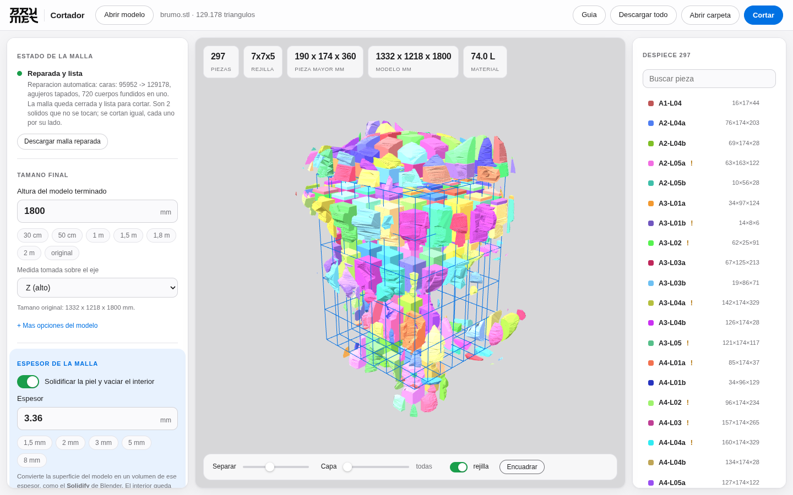
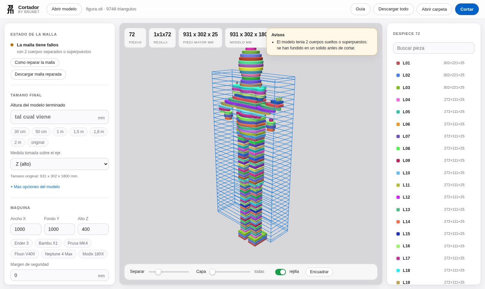
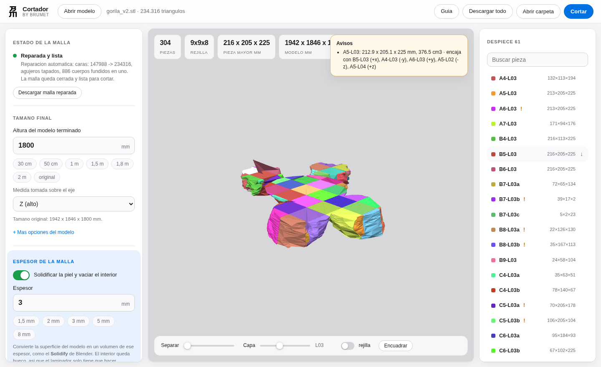
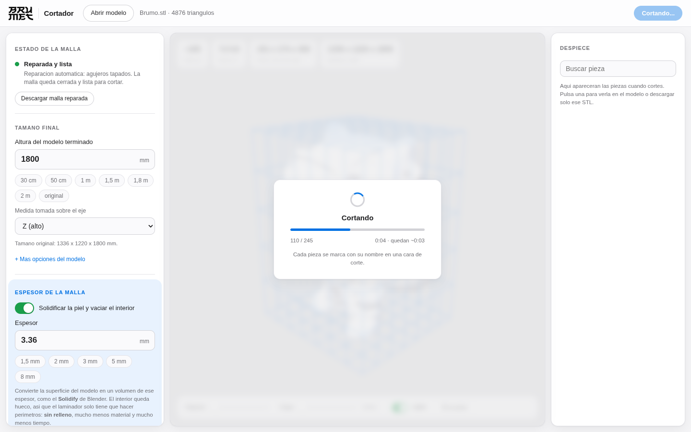
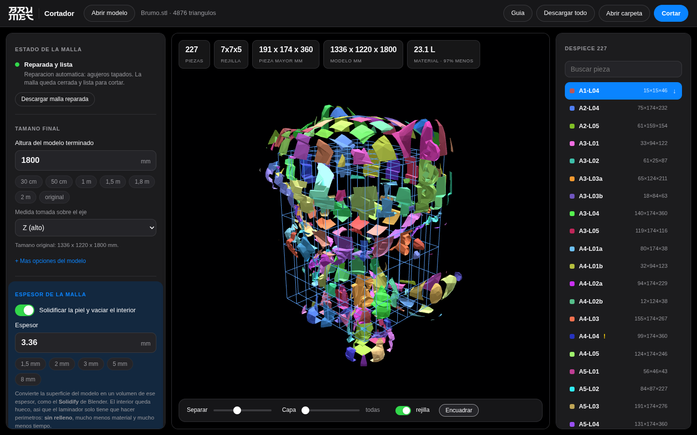

<p align="center">
  
</p>

<h1 align="center">Cortador</h1>
<p align="center"><b>by Brumet</b> · corta modelos 3D para gran formato</p>

<p align="center">
  <a href="https://github.com/Brumet/Cortador/releases/latest/download/Cortador-Setup.exe"><b>⬇ Instalar en Windows</b></a> ·
  <a href="https://github.com/Brumet/Cortador/releases/latest/download/Cortador-Linux"><b>Linux</b></a> ·
  <a href="#instalacion">Instalacion</a> ·
  <a href="#uso-la-interfaz">Uso</a> ·
  <a href="#linea-de-comandos">Terminal</a>
</p>

---

Metes una malla (STL, OBJ, PLY, 3MF...), dices **cuanto quieres que mida el modelo
terminado** y **cuanto mide tu impresora**, y Cortador hace dos cosas:

1. **Solidifica la piel del modelo** al espesor que le digas (3 mm, 5 mm...), como
   el *Solidify* de Blender: la superficie se convierte en un volumen y **el
   interior queda hueco**. El laminador ya no tiene nada que rellenar, solo
   recorrer perimetros.
2. **Corta el resultado en trozos del tamano de tu impresora**. Siempre. Ninguna
   pieza se sale de la cama.

Con un gorila de 1,80 m en una Ender 3: de **1.024 litros macizo a 22 litros**
(98 % menos de material y de horas de maquina), en 305 piezas que caben todas.

Cada pieza sale **marcada con su nombre grabado** y, si quieres, con **pasadores
de alineacion**, para que luego puedas armar el modelo entero sin volverte loco.

Es una **aplicacion de escritorio**: se abre en su propia ventana, no en el
navegador. Todo ocurre **en tu equipo**, funciona sin conexion y ningun modelo se
sube a ningun servidor. Codigo libre con licencia MIT.



---

## Instalacion

### Opcion 1 — instalador de Windows (recomendada)

1. Descarga **[Cortador-Setup.exe](https://github.com/Brumet/Cortador/releases/latest/download/Cortador-Setup.exe)**.
2. Doble clic, siguiente, siguiente. Se instala en tu carpeta de usuario, **no
   pide permisos de administrador** y crea el acceso directo en el menu Inicio
   y en el escritorio.
3. Abre **Cortador** como cualquier otro programa: se abre en su propia ventana
   en uno o dos segundos (primero la pantalla de espera, luego el panel).

Para quitarlo: *Configuracion → Aplicaciones → Cortador → Desinstalar*, como
cualquier programa normal.

**Si no abre nada**, Cortador siempre deja escrito por que:

- Menu Inicio → *Cortador* → **Registro de arranque**: abre
  `%LOCALAPPDATA%\Cortador\arranque.log` con cada paso del arranque y el
  error exacto si lo hubo.
- Menu Inicio → *Cortador* → **Diagnostico de Cortador**: informe completo
  (version, librerias, si hay WebView2, si el puerto local esta libre).

Manda cualquiera de los dos y se sabe al momento que ha pasado.

> Windows mostrara un aviso de SmartScreen la primera vez porque el instalador
> no esta firmado: *Mas informacion → Ejecutar de todas formas*. Firmar cuesta
> unos 200 euros al ano; mientras tanto, el aviso es inevitable.

### Opcion 1b — version portable

Si prefieres no instalar nada, descarga
**[Cortador-Windows.exe](https://github.com/Brumet/Cortador/releases/latest/download/Cortador-Windows.exe)**
(o **[Cortador-Linux](https://github.com/Brumet/Cortador/releases/latest/download/Cortador-Linux)**)
y ejecutalo directamente: es un solo archivo, funciona desde un USB y no deja
nada instalado.

La version portable va en un solo archivo, asi que cada vez que se abre tiene
que descomprimirse: tarda unos segundos mas que la instalada.

Si no arranca, `Cortador-Windows.exe --diagnostico` escribe un informe
(`cortador_diagnostico.txt`) al lado del ejecutable con la version, lo que
falta y si hay ventana de escritorio disponible, y `Cortador-Windows.exe
--registro` abre el registro del ultimo arranque.

### Opcion 2 — desde el codigo (Windows)

1. Descarga el codigo: en **[Releases](https://github.com/Brumet/Cortador/releases/latest)**
   baja *Source code (zip)*, o pulsa **Code → Download ZIP** en la portada del repo. Descomprimelo.
2. Doble clic en **`Cortador.bat`**. La primera vez se instala sola (necesita
   [Python](https://www.python.org/downloads/) con *Add Python to PATH* marcado);
   despues ya arranca directo.

### Opcion 3 — desde el codigo (Linux / macOS)

```bash
git clone https://github.com/Brumet/Cortador.git
cd Cortador
./cortador.sh          # instala la primera vez y abre la aplicacion
```

En Linux, la ventana de escritorio necesita WebKitGTK
(`sudo apt install python3-gi gir1.2-webkit2-4.1`) o Qt
(`pip install pyqt5 pyqtwebengine`). Si no encuentra ninguno, Cortador avisa y
abre la interfaz en el navegador para que puedas trabajar igual.

O a mano, si prefieres controlar el entorno:

```bash
python -m venv .venv && source .venv/bin/activate
pip install -e ".[web,app]"
cortador app          # ventana de escritorio
cortador web          # o en el navegador, si lo prefieres
```

### Compilar tu propio ejecutable

```bash
pip install pyinstaller
python packaging/construir.py     # deja dist/Cortador(.exe)
```

---

## Uso: la interfaz

```bash
cortador app        # o doble clic en el .exe / en Cortador.bat
```

1. **Arrastra el modelo** al visor.
2. Si la malla esta rota, Cortador la repara sola y te lo dice. Si aun asi tiene
   fallos, el boton **Reparar con 3D Builder** abre la herramienta de Windows para
   arreglarla a fondo (ver abajo).
3. Pon la **altura del modelo terminado** (hay atajos: 30 cm, 1 m, 1,8 m, 2 m...).
4. Pon el **volumen de tu maquina** (atajos para Ender 3, Bambu X1, Flsun V400,
   Neptune 4 Max, Modix...).
5. Si quieres la figura hueca, enciende **Vaciar el interior** y pon el espesor
   de la piel (1,5 / 2 / 3 / 5 / 8 mm).
6. La **rejilla de corte se dibuja en vivo** sobre el modelo: ves cuantas piezas
   van a salir antes de cortar nada.
7. **Cortar**. Mientras trabaja ves la etapa, el contador de piezas, el tiempo
   transcurrido y lo que falta, para saber que sigue avanzando.
8. Al terminar tienes la vista explosionada, el filtro por capa, el despiece
   completo y la descarga.



<p align="center"><i>Una capa aislada, para revisar lo que va en cada altura</i></p>



<p align="center"><i>Mientras trabaja siempre sabes por donde va</i></p>



<p align="center"><i>Modo oscuro automatico</i></p>



### Llevar las piezas al laminador

- **Descargar todo** → un ZIP con las piezas, la guia de armado, el CSV y los planos.
- **Abrir carpeta** → abre directamente la carpeta con los STL en tu explorador,
  para arrastrarlos al laminador (Cura, PrusaSlicer, Bambu Studio, Orca...).
- En la lista del despiece, la **flecha ↓** de cada pieza descarga **solo ese STL**.
- Cada pieza se guarda **centrada en el origen**, asi que cae directa en la cama
  del laminador sin tener que recolocarla.

---

## El espesor de la malla (solidificar)

Esto es el corazon de Cortador y es exactamente el **Solidify de Blender**: coge
la superficie del modelo, que no tiene grosor, y la convierte en un volumen del
espesor que le digas hacia dentro. La forma exterior no cambia; lo que cambia es
que el interior deja de ser macizo.

```
   seccion del modelo              solidificado a 3 mm
   ###################             ###################
   ###################             ###             ###
   ###################     --->    ###             ###
   ###################             ###             ###
   ###################             ###################
      1.024 litros                     22 litros
```

Despues, **el corte se hace siempre al tamano de tu maquina**: los trozos salen
de dividir el volumen de impresion, no del espesor. Espesor y corte son dos cosas
distintas y no se mezclan.

### Por que ahorra tanto

Una pieza con la pared ya solidificada a 3 mm se lamina con **relleno al 0 %**:
el laminador solo recorre perimetros. No hay relleno que calcular ni que
imprimir. En la carpeta de salida tienes un `AJUSTES_LAMINADOR.txt` con los
numeros exactos para tu perfil:

```
  Relleno (infill) . . . . . . . 0 %
  Perimetros / paredes . . . . . 8    (= 3 mm / 0.4 mm de linea)
  Ancho de linea . . . . . . . . 0.4 mm
```

En el panel tienes la calculadora al lado: pones **perimetros x ancho de linea**
y te da el espesor exacto (4 perimetros de 0,4 mm = 1,6 mm de pared).

### Como lo hace

Cada trozo se solidifica **por separado**, despues de cortarlo. Asi la malla de
trabajo siempre es pequena, el desplazamiento de la superficie se porta bien y,
si un trozo con recovecos muy cerrados no admite el vaciado, solo ese queda
macizo (te lo dice) en vez de arruinar el trabajo entero. En el gorila de 1,80 m
fallan 7 de 305. Si un trozo no admite todo el espesor pedido, se prueba con
algo menos antes de rendirse.

- Donde el modelo es mas fino que dos veces el espesor, la pieza se queda maciza
  sola: nunca salen piezas de aire.
- Al encoger un contorno con detalles finos aparecen esquirlas de decimas de
  milimetro, y en las esquinas de las celdas quedan recortes mas finos que la
  propia pared. Cortador los limpia (`--pieza-minima`, 5 mm por defecto).
- Los trozos sueltos de una misma celda se separan en piezas con nombre propio
  (`A2-L06a`, `A2-L06b`), cada una con su archivo y su marca.
- En un pico o un pliegue muy cerrado los vertices se cruzarian y apareceria una
  pua atravesando la pared: ahi se afina el espesor en vez de cruzarlos.

### Rebanadas apiladas (otra cosa distinta)

Aparte del corte en trozos, Cortador puede rebanar el modelo en **capas
horizontales** de una altura fija para construir por capas con laser o CNC
(contrachapado, MDF, carton). Ahi el numero que pones es la **altura de cada
rebanada**, no el espesor de la malla; las dos cosas se pueden combinar. Se
exportan ademas los contornos en **SVG y DXF** (capa `CORTE` y capa `MARCA`).

## Reparar la malla

La mayoria de modelos descargados no son un solido limpio: son varias piezas
superpuestas, con agujeros o con caras invertidas. Cortador lo maneja en tres pasos:

1. **Diagnostico** al cargar: te dice exactamente que le pasa a la malla.
2. **Reparacion automatica**: suelda vertices, quita caras degeneradas, corrige
   normales, tapa agujeros y **funde los cuerpos superpuestos** con CSG. Esto
   resuelve la gran mayoria de los casos y puedes descargar la malla ya reparada.
3. **3D Builder (Windows)**: si sigue rota, el boton la abre en 3D Builder, que
   viene con Windows y trae un reparador muy potente. Alli pulsas *Reparar*,
   **Guardar como** en STL o 3MF, y vuelves a cargar el archivo en Cortador.

Desde la terminal:

```bash
cortador info figura.stl               # que le pasa a la malla
cortador reparar figura.stl            # la arregla -> figura_reparado.stl
cortador reparar figura.stl --windows  # la abre en 3D Builder
```

---

## El corte

Siempre a la medida de tu maquina. Cortador divide el volumen del modelo en una
rejilla calculada para que **cada trozo quepa** en la cama, descontando el margen
de seguridad que le pongas.

```
   modelo 1129 x 583 x 1800       impresora 220x220x250
   +----------------+             +--+--+--+--+--+
   |                |             |A1|B1|C1|D1|E1|  L08
   |     gorila     |    --->     +--+--+--+--+--+
   |                |             |A1|B1|C1|D1|E1|  L07
   +----------------+             +--+--+--+--+--+   ...
                                   6 x 3 x 8 = 308 piezas
```

Puedes forzar las divisiones (`--divisiones 3x2x4`), dejar holgura entre piezas
para el pegado (`--kerf 0.3`) y elegir el motor de corte. Y si prefieres
construir por capas en vez de por trozos, esta el modo rebanadas explicado
arriba.

## Marcas de armado

Sin marcas, 200 piezas iguales son un rompecabezas imposible. Cortador graba el
nombre de cada pieza con una **tipografia de trazo incluida en el programa** (no
necesita fuentes del sistema).

- `A2-L07` = columna **A**, fila **2**, capa **07** contando desde abajo.
- Se graba **en una cara de corte**, que queda escondida al montar.
- Opcion de grabar **en todas las caras de corte** indicando la pieza vecina
  (`B1-L03>C1-L03`), en relieve en vez de hueco, o con un prefijo tuyo.
- El texto se ajusta solo: si no cabe se encoge, se parte en dos lineas o se gira.

```
cara de corte de la pieza B1-L03
+-----------------------+
|                       |
|      B1-L03           |   <- grabado 0,8 mm de profundidad
|                       |
+-----------------------+
```

---

## Pasadores de alineacion

| Tipo | Que genera |
|---|---|
| Sin pasadores | nada (por defecto) |
| Agujeros + espigas | agujeros ciegos en **las dos** piezas y un STL de espiga para imprimir |
| Macho / hembra | espiga solidaria a una pieza y su alojamiento en la otra |

Los puntos se eligen dentro de la seccion comun a las dos piezas y separados del
borde. Si una cara es demasiado estrecha, se salta y queda anotado en la guia.

---

## Que genera

```
salida/
├── piezas/              A1-L01.stl, A1-L02.stl, ...   (marcadas y en el origen)
├── 2d/                  A1-L01.svg / .dxf             (modo lamina plana)
├── AJUSTES_LAMINADOR.txt  relleno 0 %, perimetros y ancho de linea exactos
├── espigas/             espiga_d6mm.stl + LEEME.txt
├── GUIA_DE_ARMADO.md    orden de montaje capa por capa, con las vecinas de cada pieza
├── despiece.csv         tabla para la hoja de calculo
├── cortador.json        manifiesto completo (configuracion + plan + piezas)
└── vista_previa.glb     el despiece coloreado, para cualquier visor 3D
```

---

## Linea de comandos

```bash
cortador app                                 # abrir la aplicacion
cortador info figura.stl                     # estado de la malla
cortador reparar figura.stl                  # arreglarla
cortador plan figura.stl -i 220x220x250      # ver el plan sin cortar

# trozos que quepan, escalado a 1,80 m, con marcas y espigas
cortador cortar figura.stl --tamano 1800 -i 220x220x250 --margen 3 \
    --kerf 0.3 --marca-tam 12 --espigas agujeros -o salida/ --zip

# laminas de 5 mm, placa plana para corte laser
cortador cortar figura.stl --modo laminas --espesor 5 --estilo-lamina placa

# gorila de 1,80 m con piel de 3 mm, en trozos para una Ender 3
cortador cortar gorila.stl --tamano 1800 -i 220x220x250 --margen 2 \
    --solidificar --espesor-malla 3 --marca-tam 12
```

| Opcion | Que hace |
|---|---|
| `-i, --impresora AxBxC` | volumen util de la maquina en mm |
| `--margen N` | margen de seguridad por cara |
| `--tamano N --tamano-eje z` | **tamano final** del modelo (escala antes de cortar) |
| `--unidades mm\|cm\|m\|in` | unidades del archivo de entrada |
| `--modo trozos\|laminas` | tipo de corte |
| `--espesor N` · `--eje z` | espesor y eje de apilado de las laminas |
| `--estilo-lamina solido\|placa` | rebanada real o placa plana extruida |
| `--hueco` / `--solidificar` | solidificar la piel y vaciar el interior |
| `--pared N` / `--espesor-malla N` | espesor de esa piel (3 mm por defecto) |
| `--sin-tapas` | vaciar tambien la primera y la ultima lamina |
| `--sin-lengueta` | no anadir la plaquita interior de marcado |
| `--sin-separar-islas` | dejar en un solo archivo los trozos sueltos de una capa |
| `--pieza-minima N` | descartar trozos menores que esto (5 mm por defecto) |
| `--kerf N` | holgura entre piezas |
| `--divisiones NxNxN` | forzar divisiones (`3x-x4` deja un eje automatico) |
| `--sin-marcas` · `--marca-tam` · `--marca-prof` · `--marca-caras` | control de las marcas |
| `--prefijo TEXTO` | texto delante de cada nombre |
| `--espigas ninguna\|agujeros\|machohembra` | pasadores |
| `--formato stl\|obj\|ply\|3mf` | formato de salida |
| `--en-sitio` | exportar las piezas en su posicion dentro del modelo |
| `--motor auto\|planos\|booleano` | motor de corte |
| `--zip` | comprimir la carpeta al terminar |

`cortador cortar --help` lista todas.

---

## Uso como libreria

```python
from cortador import (LabelOptions, PrinterSpec, SliceConfig,
                      export_result, load_mesh, slice_model)

malla = load_mesh("figura.stl")

cfg = SliceConfig(
    printer=PrinterSpec(220, 220, 250, clearance=3),
    mode="slabs",             # o "chunks"
    slab_thickness=5.0,
    slab_style="prism",       # placa plana para laser
    kerf=0.2,
    hollow=True,              # vaciar: solo la piel
    wall=3.0,                 # 3 mm de pared
    target_size=1800,         # 1,80 m de alto
    labels=LabelOptions(size=10, depth=0.8),
)

resultado = slice_model(malla, cfg)
export_result(resultado, "salida/", mesh_format="stl")
```

---

## Consejos practicos

- **Espesor de la malla**: 2-3 mm aguanta bien una figura de 2 m si va pegada
  sobre una estructura; 4-5 mm si la pieza tiene que sostenerse sola. Piensalo en
  perimetros: 3 mm son 8 perimetros de 0,4 mm.
- **Kerf**: si las piezas quedan justas al pegar, prueba `0.2` o `0.3` mm.
- **Marcas**: en piezas pequenas baja la letra a 5-6 mm; con 0,6 mm de profundidad
  ya se lee bien y no debilita la pieza.
- **Espigas**: radio 3 mm y profundidad 6-8 mm van bien en piezas de 20 cm.
  Imprimelas al 100 % de relleno.
- **Laminas de 3 mm en una figura de 1,8 m** son 600 capas: mira antes el numero
  de piezas en el panel para no llevarte un susto.
- **Montaje**: la guia va capa por capa desde `L01`. Pega primero cada capa
  completa en plano y luego apila.

## Limitaciones conocidas

- No hace *nesting* (no coloca las piezas 2D en la plancha para aprovechar material).
- El corte es siempre **ortogonal**: no hay cortes en diagonal ni por superficies curvas.
- No reorienta las piezas para optimizar la impresion.
- Los modelos con auto-intersecciones muy severas pueden necesitar 3D Builder.
- El solidificado usa un desplazamiento de la superficie (como el Solidify de
  Blender): en trozos con recovecos muy cerrados puede no salir y ese trozo queda
  macizo (se avisa). En el gorila de 1,80 m fallan 11 de 308.
- El interior de cada trozo queda como una camara cerrada. Para FDM es justo lo
  que se quiere; para resina habria que anadir agujeros de drenaje a mano.
- En mallas reconstruidas o escaneadas puede haber superficies que se tocan: las
  piezas salen bien, pero el laminador pedira "reparar" al abrirlas (lo hace
  solo). Cortador te dice cuantas y cuales.

## Desarrollo

```bash
pip install -e ".[web,dev]"
pytest -q                                   # 172 pruebas
python examples/gorila_demo.py gorila.stl   # gorila de prueba de 1,8 m
python examples/desde_capas.py modelo.json modelo.stl   # capas -> STL
python examples/figura_demo.py figura.stl   # figura simple de prueba
```

| Archivo | Responsabilidad |
|---|---|
| `cortador/config.py` | opciones y validacion |
| `cortador/meshio.py` | carga, reparacion, escalado, exportacion |
| `cortador/hollow.py` | solidificado: piel 3D, anillos 2D y plaquita de marcado |
| `cortador/repair.py` | diagnostico, reparacion automatica y 3D Builder |
| `cortador/planner.py` | donde van los planos de corte y como se llama cada pieza |
| `cortador/geometry.py` | recortes por caja, secciones, booleanas tolerantes |
| `cortador/slicer.py` | el motor: rejilla -> piezas |
| `cortador/font.py` · `labels.py` | tipografia propia y grabado de las marcas |
| `cortador/joinery.py` | espigas y agujeros |
| `cortador/exporters.py` | STL/OBJ/SVG/DXF, guia, CSV, manifiesto, vista previa |
| `cortador/cli.py` | linea de comandos |
| `cortador/desktop.py` | la ventana de escritorio (pywebview) |
| `cortador/web/` | servidor local + panel y visor WebGL propio |
| `packaging/` | receta de PyInstaller para el ejecutable |

---

<p align="center">
  <br>
  <b>Cortador</b> · by <b>Brumet</b> · Licencia MIT
</p>
